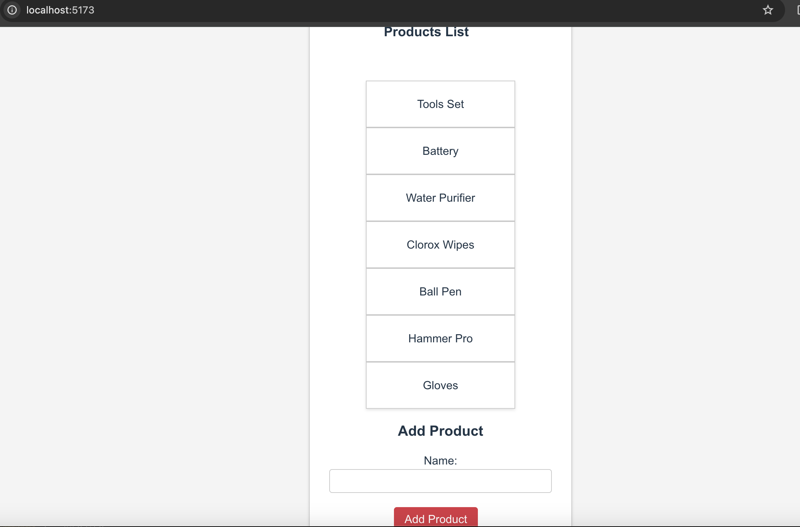
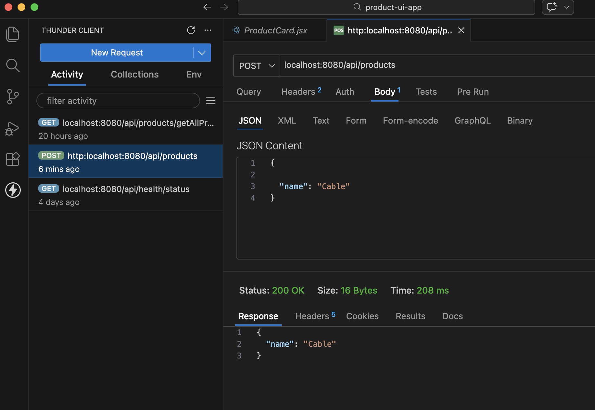
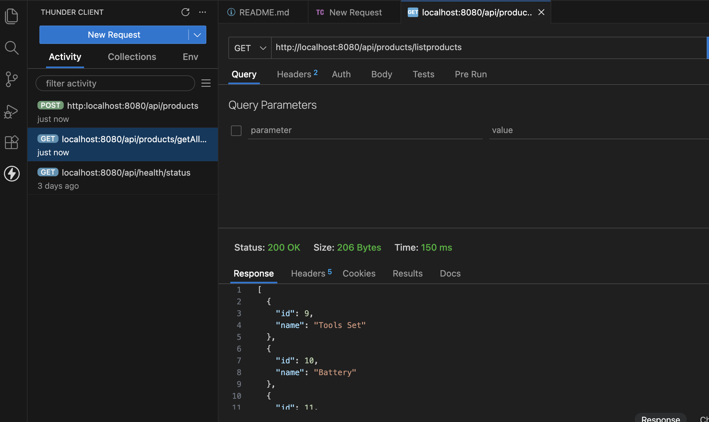
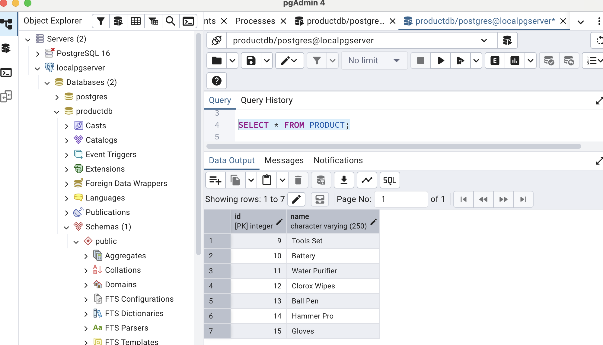
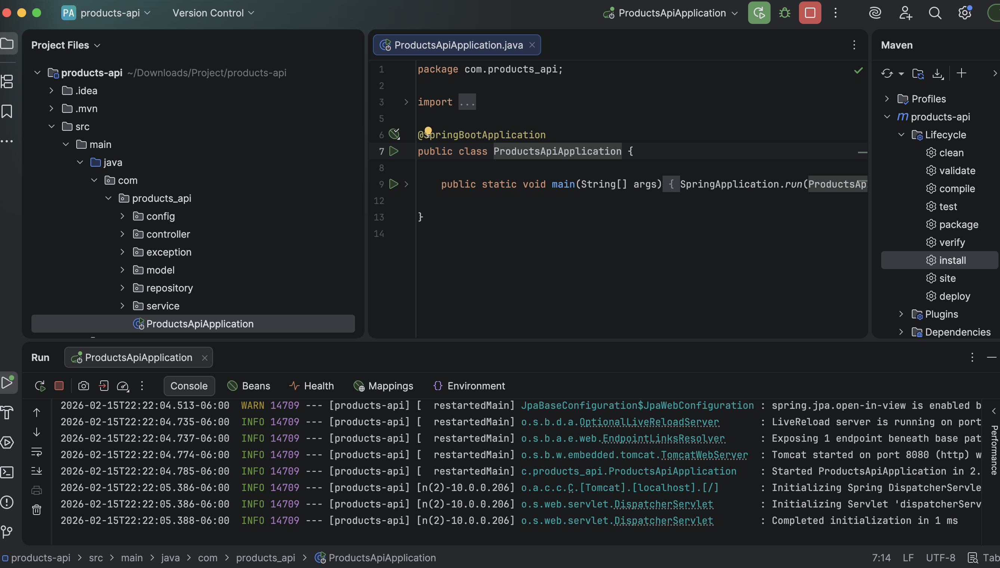
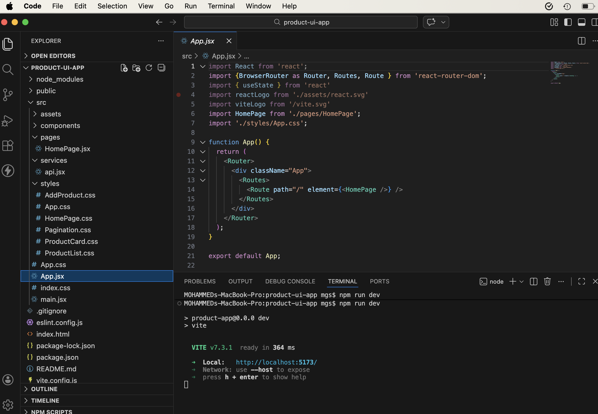

# Product Application

This is a full-stack web application built using React, Java, Spring Boot and Postgres. It allows you to add and view list of products stored in Postgres DB via a Spring Boot API in the React Frontend Web Page.

## Table of Contents

- [Installation](#installation)
- [Usage](#usage)
- [API Routes](#api-routes)
- [Example Requests with ThunderClient](#example-requests-with-thunderclient)
- [Folder Structure](#folder-structure)
- [Technologies Used](#technologies-used)

## Installation

1. **The zipped file contains 2 root folders:**

   ```bash
   product-ui-app (Frontend React application)
   products-api (Backend SpringBoot application)
   ```

2. **Navigate to Frontend folder:**

   ```bash
   cd product-app
   npm install
   ```

## Usage

1. **Start the Spring Boot application:**

   ```bash
   Open the "products-api" folder in Intellij as a new Maven Project
   Make sure to have the Java 17 as your project JDK version
   Start the Springboot application after building the application
   ```

   The backend server will run on http://localhost:8080.

2. **Start the React App:**

   ```bash
   cd product-ui-app
   npm run dev
   ```

   The React app will run on http://localhost:5173.

3. **Access the App:**

   Open your web browser and navigate to http://localhost:3000 to interact with the React app.

## API Routes

The following API routes are available:

- **GET /api/listproducts: Fetch all products.
- **POST /api/products**: Create a new product.

## Example Requests with Postman

1. **Fetch All Products**:
   - Method: GET
   - URL: http://localhost:8080/api/listsproducts


2. **Create a New Product**:
   - Method: POST
   - URL: http://localhost:8080/api/products
   - Body: JSON data with `name`, `brand` and `price`.


## Folder Structure

The project is organized into two main folders:

- **product-list-ui**: Contains the React frontend code.
- **products-api**: Contains the Spring Boot application code.

## Technologies Used

- Frontend: React
- Backend: Spring Boot, Java
- Database: Postgres

## Screenshots

Product List being shown in the React Frontend App


ThunderClient request and response for Create-Product API call


ThunderClient request and response for Get-List-Of-Products call


Local Postgres instance showing data in the DB Table


IntelliJ showing the folder structure and successfull run of the Spring Boot app


VSCode showing folder structure of React code
